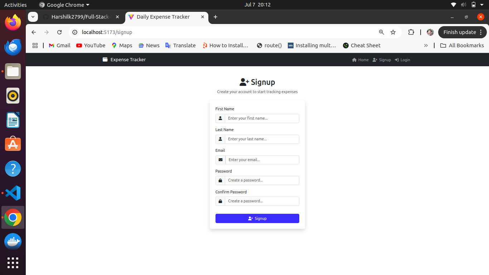
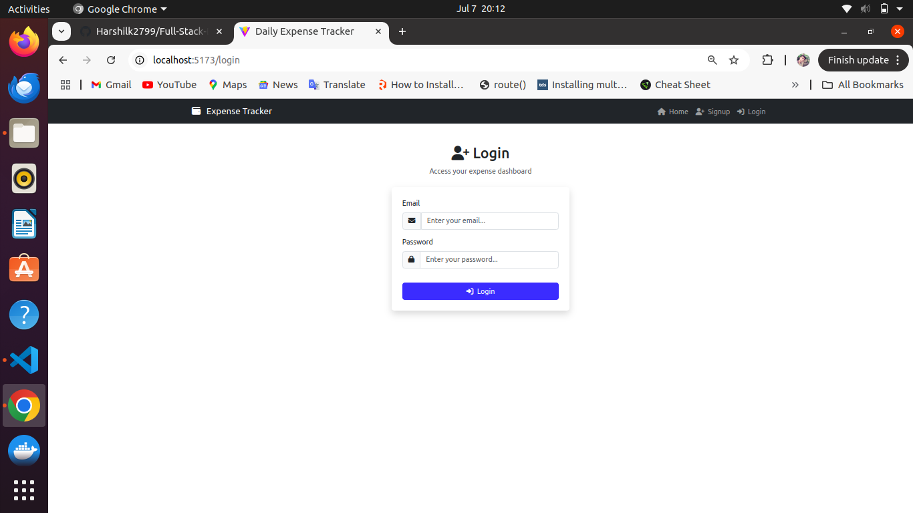
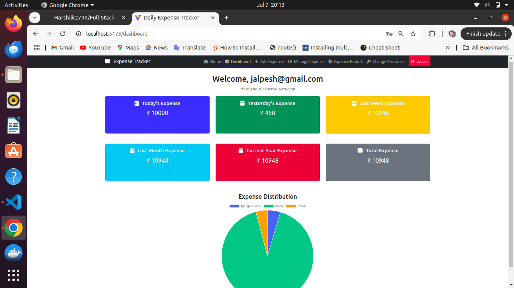
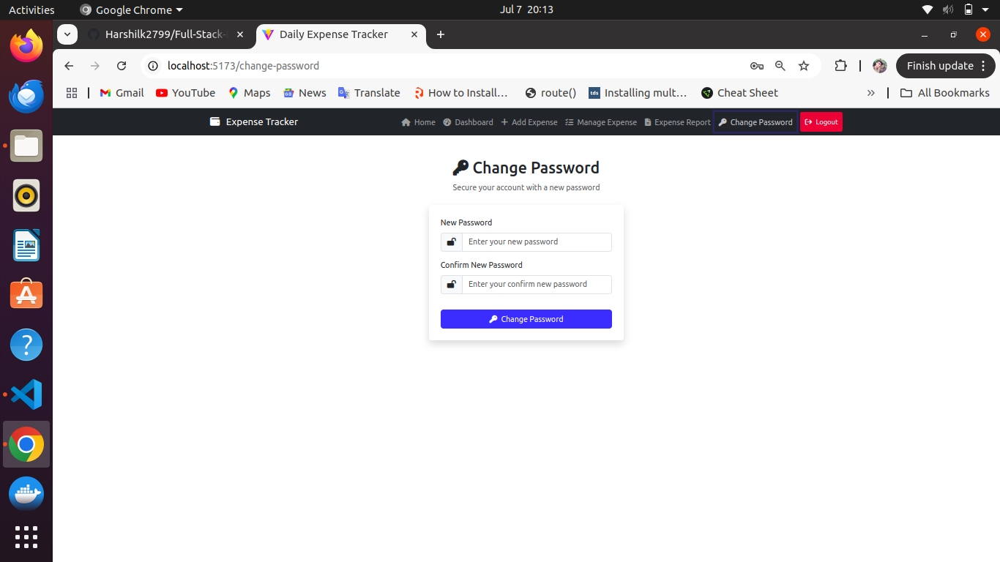
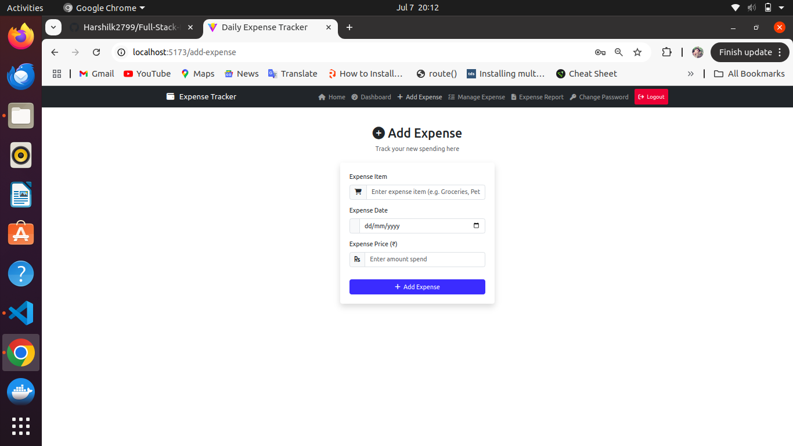
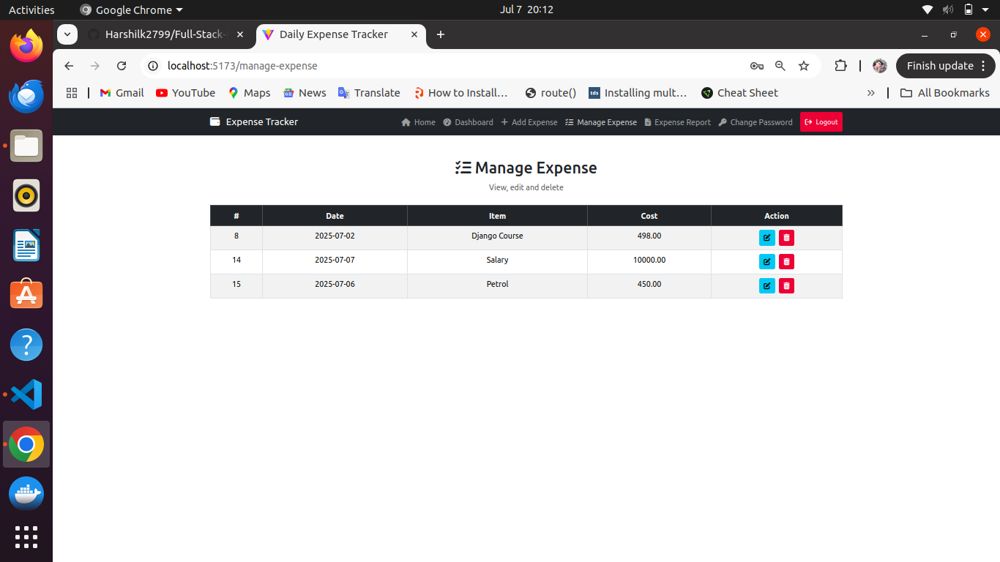
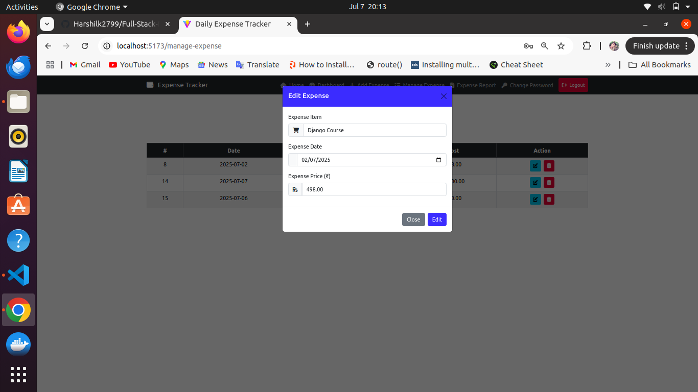
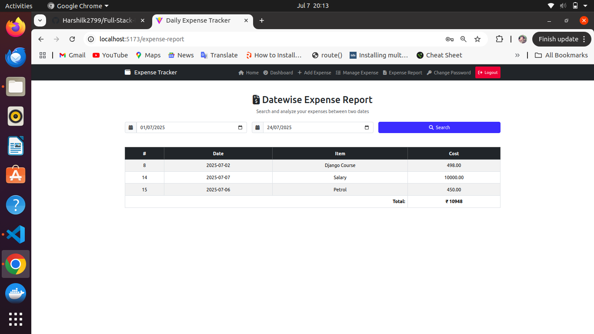

# 🔐 Daily Expense Tracker

A full-stack web application to manage your daily expenses with authentication, expense tracking, and insightful reporting.

## 🛠️ Tech Stack

### Frontend

- ReactJS
- Axios
- react-router-dom
- Bootstrap
- React Toastify

### Backend

- Django
- Django REST Framework
- Simple JWT (Token Authentication)
- Django CORS Headers

## 🔗 API Endpoints

### 🔐 Authentication

- `POST /api/user/register/` – Register a new user
- `POST /api/user/login/` – Login user and return JWT tokens
- `POST /api/user/token/refresh/` – Refresh access token
- `GET  /api/user/profile/` – Retrieve authenticated user's profile
- `POST /api/user/changepassword/` – Change password (authenticated users only)

### Daily Expense Tracker

- `POST /api/expense/add-expense/` – Add a new expense entry
- `GET /api/expense/manage-expense/` – Retrieve all expenses for the logged-in user
- `PATCH /api/expense/edit-expense/<int:expense_id>/` – Update an existing expense
- `DELETE /api/expense/delete-expense/<int:expense_id>/` – Delete a specific expense
- `GET /api/expense/search-expense/` – Search/filter expenses by date range or category

## 🔧 Setup Instructions

### Backend (Django)

```bash
cd backend
python -m venv env
source env/bin/activate
pip install -r requirements.txt
python manage.py migrate
python manage.py runserver
```

## 🌟 Features

### ✅ User Registration

- **Form Fields**: First Name, Last Name, Email, Password, Confirm Password
- **Validation**: All fields required; password match enforced
- **Navigation**: Link to Sign In if already registered

  

### 🔓 User Login

- **Form Fields**: Email, Password
- **Navigation**: Link to Sign Up for new users

  

### 🧑‍💻 User Dashboard

- The **Dashboard** provides a comprehensive visual summary of the user's expense activity. It is the central hub after login.

  

#### ✅ Features

- **User Greeting**: Displays a personalized welcome message with the user's **email**.
- **Quick Stats**: Highlights total expenses for various durations:
  - 📅 **Today’s Expense**
  - 📆 **Yesterday’s Expense**
  - 📊 **Last Week Expense**
  - 📈 **Last Month Expense**
  - 📅 **Current Year Expense**
  - 💰 **Total Expense**
- **Color-coded Cards**: Each card is visually distinct for better readability and faster insights.
- **Expense Distribution Chart**:
  - 📊 A **Pie Chart** summarizing expenses based on **categories** (like Salary, Food, Course, etc.).
  - Helps users identify where they spend most frequently.
- **Navigation Bar** includes:
  - **Home**
  - **Dashboard**
  - **Add Expense**
  - **Manage Expense**
  - **Expense Report**
  - **Change Password**
  - 🔴 **Logout**

### 🔁 Change Password

- **Form Fields**: New Password, Confirm Password
- **Validation**: Password confirmation required

  

### 🔁 Change Password

- **Form Fields**: New Password, Confirm Password
- **Validation**: Password confirmation required

  

### ➕ Add Expense

The **Add Expense** page allows users to log new spending quickly and efficiently.



#### ✅ Features

- **Expense Item Input**: Enter a description of the expense (e.g., Groceries, Rent, Pet Food).
- **Date Picker**: Select the exact date the expense occurred.
- **Amount Field**: Input the total amount spent (₹).
- **Submit Button**:
  - Adds the expense to the database.
  - Triggers UI updates like dashboard summary and manage expense listing.

### 🗂️ Manage Expense

The **Manage Expense** page provides an overview of all recorded expenses, allowing users to **edit** or **delete** entries in one place.



#### ✅ Features

- **Expense Table View**:

  - Displays a list of all user-added expenses.
  - Shows columns:
    - **#**: Unique ID
    - **Date**: When the expense occurred
    - **Item**: Expense description (e.g., Django Course, Petrol)
    - **Cost**: Expense amount (₹)
    - **Action**: Icons to edit or delete

- **Delete Expense**:
  - 🗑️ Click the **Delete (🗑️)** icon to remove the expense.
  - Prompts confirmation before permanent deletion.

### ✏️ Edit Expense

The **Edit Expense** feature allows users to modify previously added expenses through a popup modal form.



#### ✅ Features

- **Popup Modal Form**:

  - Triggered when the user clicks the ✏️ **Edit** icon from the **Manage Expense** table.
  - Displays a pre-filled form containing:
    - **Expense Item**
    - **Expense Date**
    - **Expense Price (₹)**

- **Update Functionality**:

  - After editing the details, clicking **Edit** updates the record via an API.
  - Real-time reflection in the dashboard and manage table after update.

- **Close Button**:
  - Dismisses the popup without saving changes.

### 🧾 Datewise Expense Report

The **Datewise Expense Report** screen enables users to search, filter, and analyze expenses within a specific date range.



#### ✅ Features

- **Date Range Filters**:

  - Select **From Date** and **To Date** using calendar pickers.
  - Allows filtering of expenses between any two selected dates.

- **Search Button**:

  - Fetches filtered data upon clicking **Search**.
  - Executes backend API call to return matching expenses.

- **Filtered Expense Table**:

  - Displays results in a structured table format:
    - **#**: Expense ID
    - **Date**: Expense date
    - **Item**: Description of the expense
    - **Cost**: Amount in ₹

- **Total Calculation**:
  - Sums up all expenses in the filtered result set.
  - Displayed clearly at the bottom of the table.
